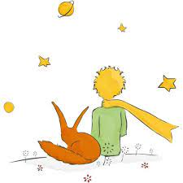

# COLLABORATION ACTIVITY/GROUP WORK [draft]
## Nicole Cojuangco

| :crown:  **TOPIC** | :dart:  **OBJECTIVES** | :handshake: **GROUPWORK COMPONENT/STRATEGY** | 
| ----------- | ----------- |  :-----------:| 
| SENSORS | *I can develop a code that incorporates 2 or more sensors to meet the robotics challenge   *I can use my documentation of our DESIGN steps to collaborate with other groups to refine our programs|Pair Programming  +  Whole Group Collaboration |

### ANALYSIS/REFLECTION QUESTIONS:, drafting still
- What are the intended benefits of groupwork over solo work?
   
  `my answer`
- Mechanisms for gauging how well it is working?
   
  `my answer`
- What instructions/guidance will students get re: the groupwork mechanics?
   
  `my answer`
- What long-term or class-wide goals does help achieve?
near-termD
 `my answer`

**RESOURCES**|[drafting this portion still](https://github.com/msCOJUANGCO/nycscertweb/blob/main/SuperArray.java) | [CS AWESOME:ArrayList Methods](https://www.youtube.com/watch?v=kyiIyyYHXfo)